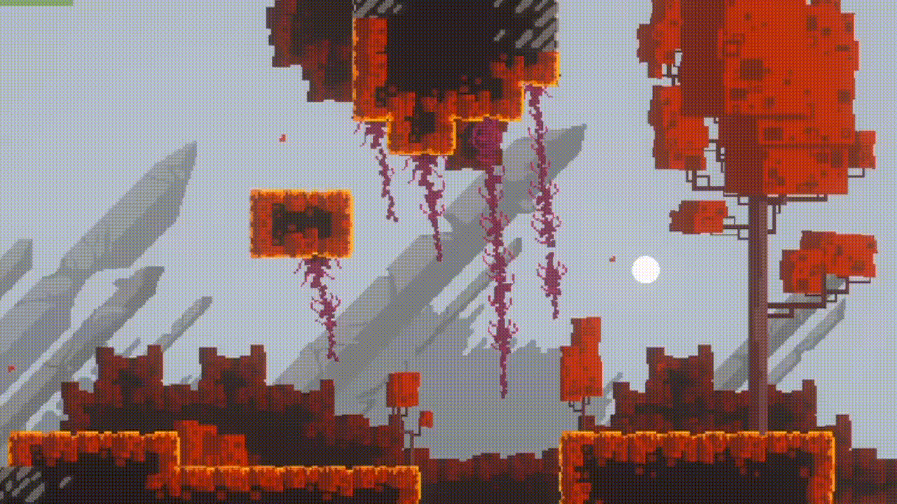
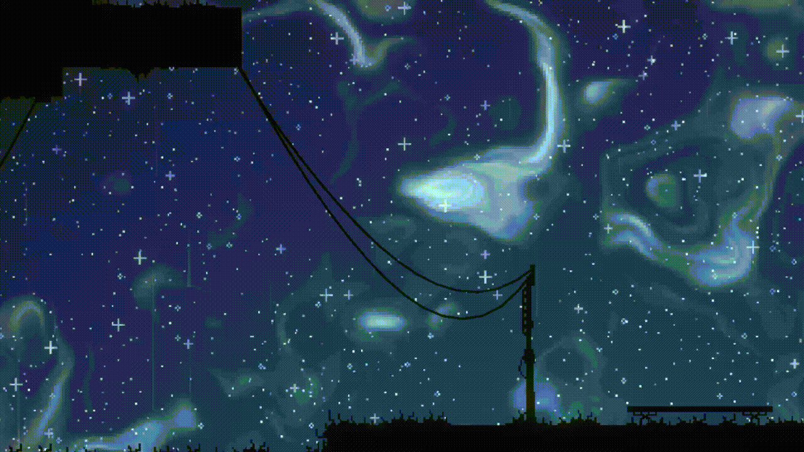
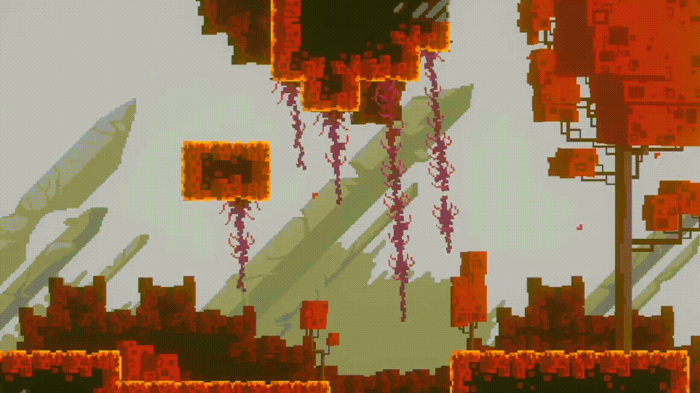

# Lines Simulation for Unity 2D

Unity package that provides an easy-to-use system for creating 2D lines that react to physics: gravity, wind, collisions and external velocity impulses. The package includes components and editor helpers to author, simulate and visualize cable-like or rope-like lines for 2D games.



**Contents**
- `Runtime/` — Simulation runtime scripts and assets 
- `Editor/` — Editor inspectors and helpers for authoring lines.
- `DL_CS.compute` — Optional compute shader used to accelerate the simulation.

**Core components**
- `DynamicLineManager` — The Manager is a Singleton that handles the compute shader and data transfer between the CPU and GPU
- `DynamicLine` — Main runtime component representing a simulated line made from a sequence of nodes connected by constraints.
- `RegularLineObject` / `LineObject` — Optional Utility objects to represent a line or an attachable object along a line.


## How the simulation works
- The line is modeled as a series of nodes linked by distance/constraint relationships that enforce segment lengths.
- Each simulation step applies external forces (gravity, wind, user-supplied forces) to the points, integrates positions (position-based or verlet-style integration), and iteratively solves constraints so segments maintain their target lengths.
- Collision handling is performed for simple colliders like Circle Colliders or Box Colliders, each collider information is sent to the GPU where the collision is performed.
- Lines parameters influences the constants used in the physics equations in the compute shader, these include :
  ```cs
  public struct LineParams
    {
        public float stiffness;
        public float velocityScale;
        public Vector2 windForce;
    }
  ```

### Default Lines

By default, a line has just one position constraint and can be visualized with a line renderer component

A second constraint can be added to simulate a cable-like line



### Adding Objects to the Lines

Instead of a lineRenderer, sprite or any prefab can be added along the line to make it more dynamic, we can then have different logic as for how the object rotates along the line

if the object rotates along with the line:


if the object rotates independently, objects look like they are hanging:


### Custom Forces

Additionally to gravity, wind and spring forces, other forces can be added to achieve specific behaviour. 

For example I created a 'velocity emitter' inspired by a video by Aarthificial to simulate velocity with colors on a render texture that is then sent to the compute shader, thus giving us a distribution of a custom force that depends on the position on the screen that can be added to the wind (the red noise)


### Cutting lines

Lines can be cut into two separate lines, the number of constraints then is reduced by one, some segments can then be completely free from any constraints and just fall.

To free up memory, free segments are automatically disposed after a defined time.


The Scene view shows the objects that are dynamically spawned after each cut.